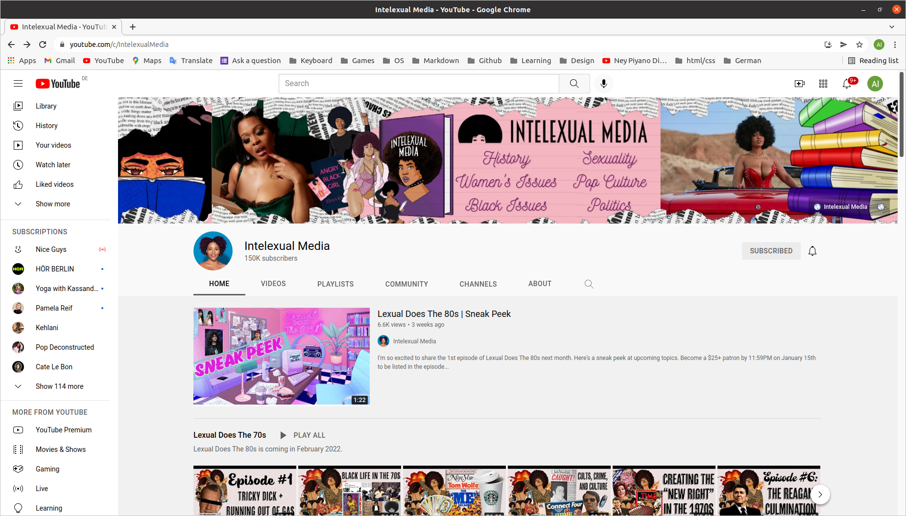

## YouTube Clone

**[Test this app yourself](aliceheneghan.github.io/utube/)**

---

#### Navigation

- [About Project](#about-project)
  - _Description_
  - _Developed With_
- [Contact](#contact)
  - _Mail_
  - _GitHub_
  - _LinkedIn_
- [Used Tools](#used-tools)
  - _Fonts_
  - _Design_
  - _Icons_
  - _Colors_

---

### About Project

##### Description

_YouTube - clone_
Create a webpage using Html/Css to recreate a YouTube channel homepage.
This project is static, that means there are no functioning buttons.

##### Developed With

- [x] _HTML5_
- [x] _CSS3_
- [ ] _SASS_
- [ ] _SCSS_
- [ ] _JavaScript_
- [ ] _React_
- [ ] _Bootstrap_
- [x] _npm_

---

### Contact

Mail: <heneghan31@mail.com> 
GitHub: [aliceheneghan](https://github.com/aliceheneghan) 
LinkedIn: [your linkedIn](https://linkedin.com/in/alicehen)

---

### Used Tools

- [icons](https://)
- [npm](https://www.npmjs.com/)
- [Google Fonts](https://fonts.google.com/)
- [Visual Studio Code](https://code.visualstudio.com/)

---

This project is for **educational** purposes.